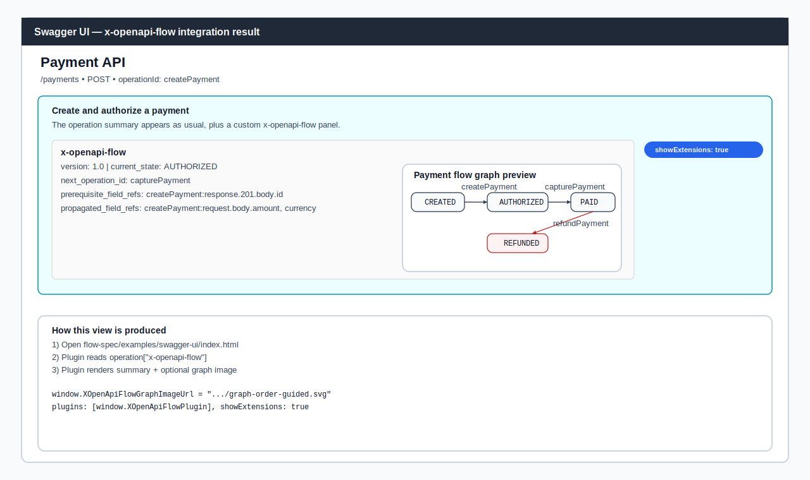

# x-openapi-flow

[](https://www.npmjs.com/package/x-openapi-flow)
[](https://www.npmjs.com/package/x-openapi-flow)


[](https://github.com/tiago-marques/x-openapi-flow/actions/workflows/x-openapi-flow-validate.yml)
[](https://github.com/tiago-marques/x-openapi-flow/issues)
[](https://github.com/tiago-marques/x-openapi-flow/commits/main)


`x-openapi-flow` is an OpenAPI vendor extension and CLI for documenting and validating resource lifecycle workflows.

It adds explicit state-machine metadata (`x-openapi-flow`) to operations and validates both schema and lifecycle graph consistency.

## Why It Exists

Most teams document endpoints but not lifecycle behavior. State transitions become implicit, inconsistent, and hard to validate in CI.

## Quick Start

Initialize on an existing OpenAPI file:

```bash
npx x-openapi-flow init openapi.yaml
```

Validate a spec:

```bash
x-openapi-flow validate examples/order-api.yaml
```

Generate a graph:

```bash
x-openapi-flow graph examples/order-api.yaml
```

## Initialization Behavior

Running `init` will:

- Auto-detects OpenAPI files (such as `openapi.yaml`, `openapi.json`, `swagger.yaml`)
- Creates/synchronizes `{context}-openapi-flow.(json|yaml)` (sidecar with your lifecycle definitions)
- Re-applies existing `x-openapi-flow` blocks into your OpenAPI file

Project file roles:

- Source of truth for API shape: your generated OpenAPI file (`openapi.yaml`)
- Source of truth for lifecycle metadata: `{context}-openapi-flow.(json|yaml)`
- CLI/config: `x-openapi-flow.config.json` (optional)

Recommended update loop:

1. Regenerate/update your OpenAPI file with your framework tool.
2. Run `x-openapi-flow apply openapi.yaml` to inject sidecar lifecycle data.
3. Run `x-openapi-flow validate openapi.yaml --profile strict` to enforce consistency.

## Quickstart (Local Development)

```bash
cd flow-spec
npm install
node bin/x-openapi-flow.js validate examples/order-api.yaml
```

## Repository Structure

- `flow-spec/schema/flow-schema.json`: extension JSON Schema contract.
- `flow-spec/lib/validator.js`: validation engine (schema + graph consistency).
- `flow-spec/bin/x-openapi-flow.js`: validation CLI.
- `flow-spec/examples/*.yaml`: OpenAPI examples with `x-openapi-flow`.
- `.github/workflows/x-openapi-flow-validate.yml`: CI validation workflow example.

## Extension Contract

`x-openapi-flow` allows documenting, per operation, the current lifecycle state (`current_state`) and allowed transitions (`transitions`) with explicit triggers.

### Minimum Required Fields

Each `x-openapi-flow` block must include:

- `version`: extension contract version (`"1.0"`)
- `id`: unique identifier of the flow step
- `current_state`: state represented by the operation

### Optional Transition Guidance

Optional transition guidance fields:

- `next_operation_id`: operationId typically called for the next transition
- `prerequisite_operation_ids`: operationIds expected before a transition
- `prerequisite_field_refs`: required field references before a transition
- `propagated_field_refs`: field references reused in downstream flows

### Field Reference Format

Field reference format:

- `operationId:request.body.field`
- `operationId:response.<status>.body.field` (example: `createPayment:response.201.body.id`)

## Install and Run

Package installation:

```bash
npm install x-openapi-flow
```

Try instantly with npx:

```bash
npx x-openapi-flow init
```

Installed global command:

```bash
x-openapi-flow
```

Run tests locally:

```bash
cd flow-spec
npm install
npm test
```

Optional mirror on GitHub Packages (default usage remains unscoped on npm):

```bash
npm config set @tiago-marques:registry https://npm.pkg.github.com
npm install @tiago-marques/x-openapi-flow
```

When authentication is required, add this to your `.npmrc`:

```ini
//npm.pkg.github.com/:_authToken=${GH_PACKAGES_TOKEN}
```

Use a GitHub PAT with `read:packages` (install) and `write:packages` (publish).

## CLI Reference

### Commands

```bash
x-openapi-flow validate <openapi-file> [--format pretty|json] [--profile core|relaxed|strict] [--strict-quality] [--config path]
x-openapi-flow init [openapi-file] [--flows path]
x-openapi-flow apply [openapi-file] [--flows path] [--out path]
x-openapi-flow graph <openapi-file> [--format mermaid|json]
x-openapi-flow doctor [--config path]
```

### Common Commands

```bash
x-openapi-flow validate examples/payment-api.yaml
x-openapi-flow init openapi.yaml
x-openapi-flow apply openapi.yaml
x-openapi-flow graph examples/order-api.yaml
x-openapi-flow doctor
```

### Advanced Options

```bash
x-openapi-flow validate examples/order-api.yaml --profile relaxed
x-openapi-flow validate examples/quality-warning-api.yaml --strict-quality
x-openapi-flow validate examples/ticket-api.yaml --format json
x-openapi-flow apply openapi.yaml --out openapi.flow.yaml
```

`init` works on an existing OpenAPI file in your repository. It auto-discovers common names (`openapi.yaml`, `openapi.json`, `swagger.yaml`, etc.) when no path is provided.
`init` also creates/synchronizes a sidecar file named from the OpenAPI context (for example, `swagger-openapi-flow.json` or `openapi-openapi-flow.yaml`) to persist your `x-openapi-flow` definitions across OpenAPI regenerations.
Use `apply` after regenerating your OpenAPI file to re-inject persisted `x-openapi-flow` blocks from the sidecar.
If no OpenAPI/Swagger file exists yet, create one with your framework's official OpenAPI/Swagger generator first.

## Regeneration Workflow

```bash
# 1) generate/open your OpenAPI file (framework-specific)

# 2) initialize and sync sidecar
x-openapi-flow init openapi.yaml

# 3) edit {context}-openapi-flow.(json|yaml) with your flow states/transitions

# 4) whenever OpenAPI is regenerated, re-apply flows
x-openapi-flow apply openapi.yaml
```

## Copilot Ready (AI Sidecar Authoring)

The most sensitive part of adoption is usually authoring lifecycle data in the sidecar.
This repository includes an AI authoring guide at `llm.txt` to help assistants populate sidecar files with higher consistency.

Recommended AI-assisted flow:

1. Run `x-openapi-flow init openapi.yaml`.
2. Ask your AI assistant to fill `{context}-openapi-flow.(json|yaml)` using `llm.txt`.
3. Run `x-openapi-flow apply openapi.yaml`.
4. Run `x-openapi-flow validate openapi.yaml --profile strict`.

The `llm.txt` guide covers required fields, transition modeling, field reference formats, and a quality checklist.

Prompt template (copy/paste):

```text
Use llm.txt from this repository as authoring rules.
Read my OpenAPI file and populate {context}-openapi-flow.(json|yaml) only.
Do not change endpoint paths or HTTP methods.
Generate x-openapi-flow per operationId with coherent states/transitions,
including next_operation_id, prerequisite_field_refs, and propagated_field_refs when applicable.
Then run: init -> apply -> validate --profile strict.
```

## Validation

### Profiles

- `strict` (default): schema + advanced graph checks as errors; quality as warnings (or errors with `--strict-quality`).
- `relaxed`: schema and orphan checks as errors; advanced/quality checks as warnings.
- `core`: validates only schema and orphan states.

### File-Based Configuration

You can use `x-openapi-flow.config.json` in the current directory (or pass it via `--config`):

```json
{
	"profile": "strict",
	"format": "pretty",
	"strictQuality": false
}
```

Example file: `flow-spec/x-openapi-flow.config.example.json`.

### What Gets Validated

1. **Schema validation**: enforces shape and required fields of `x-openapi-flow`.
2. **Graph validation**: detects orphan `target_state` entries (without matching `current_state` in any operation).
3. **Advanced graph checks**:
	- requires at least one initial state (`indegree = 0`)
	- requires at least one terminal state (`outdegree = 0`)
	- detects unreachable states from initial states
	- detects cycles (flow must be acyclic)
4. **Quality checks**:
	- warns when there are multiple initial states
	- warns about duplicate transitions (`from + to + trigger_type`)
	- warns about states with no path to any terminal state
	- warns about invalid operation and field references in transitions

By default, quality checks produce **warnings**. Use `--strict-quality` to treat them as errors (exit code 1).

## Visualization

### Graph Output

`x-openapi-flow graph` generates Mermaid (or JSON) output for the state flow, helping review between developers and architecture teams.
When transitions include `next_operation_id` and `prerequisite_operation_ids`, Mermaid edges include those values as labels.

Example:

```bash
x-openapi-flow graph examples/order-api.yaml
```

Example graph image:


### Swagger UI Integration

Current automated tests in this repository use only CLI execution (`node:test`) and do not use Swagger UI, ReDoc, or RapiDoc.

To visualize and interpret `x-openapi-flow` in Swagger UI:

1. Enable vendor extension rendering with `showExtensions: true`.
2. Use the example plugin in `flow-spec/examples/swagger-ui/x-openapi-flow-plugin.js`.
3. Open `flow-spec/examples/swagger-ui/index.html` and point it to your OpenAPI file.

This plugin adds a small operation summary panel showing key `x-openapi-flow` fields like `version` and `current_state`.
It can also render a graph image if `graph_image_url` is present in `x-openapi-flow` (or if `window.XOpenApiFlowGraphImageUrl` is configured).

Example result image:



## CI Integration

There is a ready-to-use workflow in `.github/workflows/x-openapi-flow-validate.yml`.
To adapt it to your real OpenAPI files, update the paths in the `Validate x-openapi-flow examples` step.

## Included Examples

- `payment-api.yaml` (financial)
- `order-api.yaml` (e-commerce/logistics)
- `ticket-api.yaml` (support)
- `quality-warning-api.yaml` (demonstrates quality warnings)
- `non-terminating-api.yaml` (demonstrates `non_terminating_states`)

## Changelog

Version history is tracked in `CHANGELOG.md`.
Release notes are available in `RELEASE_NOTES_v1.2.0.md`.

## Documentation Language Policy

All project documentation must be written in English.

This includes:

- Repository Markdown files (`*.md`)
- GitHub Wiki pages
- Release notes and changelog entries

If a contribution includes non-English documentation content, it should be translated to English before merge.