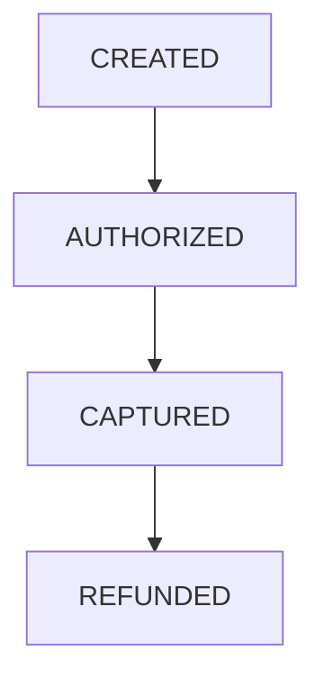

[](https://www.npmjs.com/package/x-openapi-flow)
[](https://www.npmjs.com/package/x-openapi-flow)


[](https://github.com/tiago-marques/x-openapi-flow/actions/workflows/x-openapi-flow-validate.yml)
[](https://github.com/tiago-marques/x-openapi-flow/issues)
[](https://github.com/tiago-marques/x-openapi-flow/commits/main)


# OpenAPI describes APIs. x-openapi-flow describes their workflows — for developers and AI.


> Visualizing API lifecycle directly from your OpenAPI spec

`x-openapi-flow` adds a **declarative state machine** to your OpenAPI spec.
Model resource lifecycles, enforce valid transitions, and generate flow-aware artifacts for documentation, SDKs, and automation.

🚀 1,300+ downloads in the first 3 weeks

## What You Get

- Lifecycle-aware API docs in Swagger UI and Redoc
- Flow/state-machine validation in CI
- Automatic lifecycle diagrams from your OpenAPI + sidecar metadata
- Flow-aware SDK generation
- Postman/Insomnia collections organized by lifecycle
- AI-friendly API contracts for agentic integrations

## Quick Start

```bash
npx x-openapi-flow init
```

Typical loop after OpenAPI regeneration:

```bash
npx x-openapi-flow apply openapi.yaml --out openapi.flow.yaml
npx x-openapi-flow validate openapi.flow.yaml --profile strict --strict-quality
```

### Real Lifecycle Example

A common payment lifecycle:

`CREATED -> AUTHORIZED -> CAPTURED -> REFUNDED`

Generate a graph:

```bash
npx x-openapi-flow graph openapi.flow.yaml --format mermaid
```

Generated diagram:


```mermaid
graph TD
CREATED --> AUTHORIZED
AUTHORIZED --> CAPTURED
CAPTURED --> REFUNDED
```

## SDK Generation (Flow-Aware)

Generate a TypeScript SDK that reflects lifecycle transitions:

```bash
npx x-openapi-flow generate-sdk openapi.flow.yaml --lang typescript --output ./sdk
```

Chainable usage example:

```ts
const payment = await sdk.payments.create({ amount: 1000 });
await payment.authorize();
await payment.capture();
```

This reduces invalid calls by guiding integrations through valid transition paths.

## Who Is This For

- API platform teams
- Companies with complex API workflows
- SDK teams
- API-first organizations
- Teams building AI agents that call APIs

## OpenAPI vs x-openapi-flow

| Capability | OpenAPI | x-openapi-flow |
| --- | --- | --- |
| Endpoint contracts | Yes | Yes (extends OpenAPI) |
| Lifecycle states | No | Yes |
| Transition validation | No | Yes |
| Flow diagrams | No | Yes |
| Usage guidance (next valid actions) | Limited/manual | Built-in via lifecycle metadata |

## Integration Demos

### Swagger UI

```bash
cd example/swagger-ui
npm install
npm run apply
npm start
```


### Redoc

```bash
cd example/redoc
npm install
npm run apply
npm run generate
```


### Postman

```bash
cd example/postman
npm install
npm run apply
npm run generate
```


### Insomnia

```bash
cd example/insomnia
npm install
npm run apply
npm run generate
```


## Installation

Install from npm:

```bash
npm install x-openapi-flow
```

Optional mirror from GitHub Packages:

```bash
npm config set @tiago-marques:registry https://npm.pkg.github.com
npm install @tiago-marques/x-openapi-flow
```

If authentication is required, add to `.npmrc`:

```ini
//npm.pkg.github.com/:_authToken=${GITHUB_PACKAGES_TOKEN}
```

## CLI Reference (Selected)

```bash
npx x-openapi-flow help [command]
npx x-openapi-flow --help
npx x-openapi-flow version
npx x-openapi-flow validate <openapi-file> [--profile core|relaxed|strict] [--strict-quality]
npx x-openapi-flow init [--flows path] [--force] [--dry-run]
npx x-openapi-flow apply [openapi-file] [--flows path] [--out path]
npx x-openapi-flow graph [openapi-file] [--format mermaid|json]
npx x-openapi-flow generate-sdk [openapi-file] --lang typescript [--output path]
npx x-openapi-flow export-doc-flows [openapi-file] [--output path] [--format markdown|json]
npx x-openapi-flow generate-redoc [openapi-file] [--output path]
npx x-openapi-flow doctor [--config path]
npx x-openapi-flow completion [bash|zsh]
```

Full details:

- [docs/wiki/reference/CLI-Reference.md](docs/wiki/reference/CLI-Reference.md)
- [x-openapi-flow/README.md](x-openapi-flow/README.md)

## Documentation and Guides

- Adoption guide: [docs/wiki/getting-started/Adoption-Playbook.md](docs/wiki/getting-started/Adoption-Playbook.md)
- Troubleshooting: [docs/wiki/reference/Troubleshooting.md](docs/wiki/reference/Troubleshooting.md)
- Real examples: [docs/wiki/engineering/Real-Examples.md](docs/wiki/engineering/Real-Examples.md)
- Integrations:
  - [docs/wiki/integrations/Swagger-UI-Integration.md](docs/wiki/integrations/Swagger-UI-Integration.md)
  - [docs/wiki/integrations/Redoc-Integration.md](docs/wiki/integrations/Redoc-Integration.md)
  - [docs/wiki/integrations/Postman-Integration.md](docs/wiki/integrations/Postman-Integration.md)
  - [docs/wiki/integrations/Insomnia-Integration.md](docs/wiki/integrations/Insomnia-Integration.md)

## Roadmap

- Roadmap umbrella: [#2](https://github.com/tiago-marques/x-openapi-flow/issues/2)
- Python SDK MVP: [#3](https://github.com/tiago-marques/x-openapi-flow/issues/3)
- Go SDK MVP: [#4](https://github.com/tiago-marques/x-openapi-flow/issues/4)
- Kotlin SDK MVP: [#5](https://github.com/tiago-marques/x-openapi-flow/issues/5)

## Changelog

- Version history: [CHANGELOG.md](CHANGELOG.md)
- Release notes: [docs/wiki/releases/RELEASE_NOTES_v1.4.0.md](docs/wiki/releases/RELEASE_NOTES_v1.4.0.md)

## Documentation Language Policy

All project documentation should be written in English.
