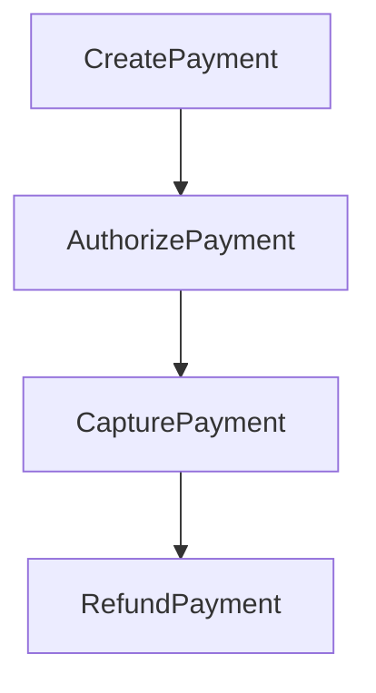
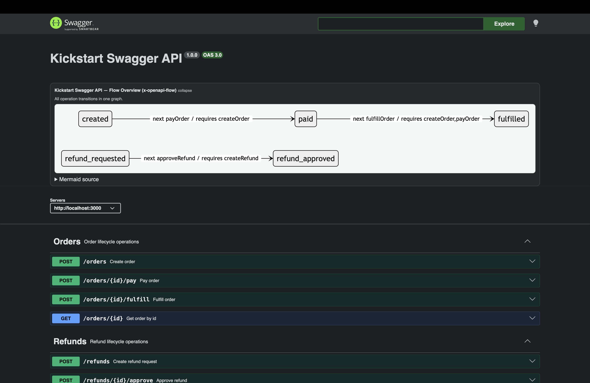
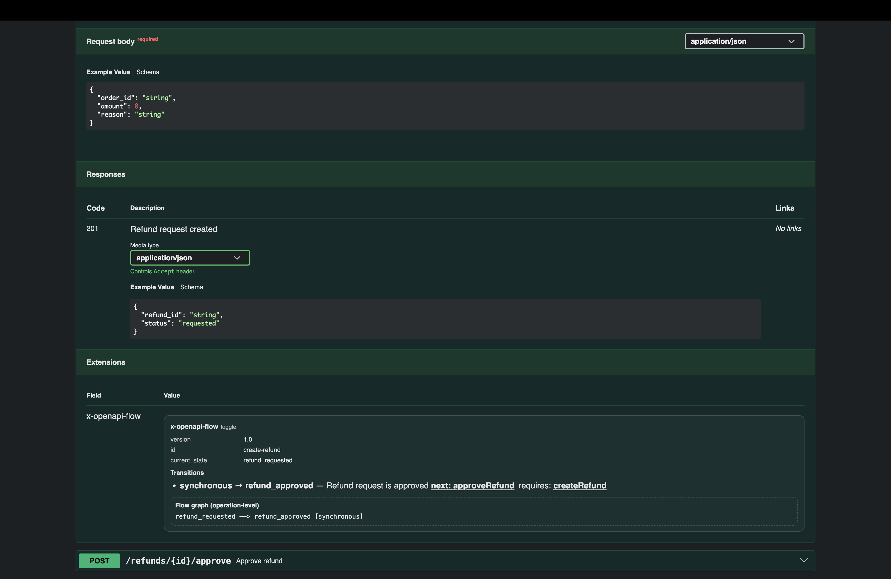

[](https://www.npmjs.com/package/x-openapi-flow)
[](https://www.npmjs.com/package/x-openapi-flow)


[](https://github.com/tiago-marques/x-openapi-flow/actions/workflows/x-openapi-flow-validate.yml)
[](https://github.com/tiago-marques/x-openapi-flow/issues)
[](https://github.com/tiago-marques/x-openapi-flow/commits/main)


# x-openapi-flow

**OpenAPI tells you what endpoints exist.**
**x-openapi-flow tells you how to use them safely.**

`x-openapi-flow` is an OpenAPI vendor extension and CLI for documenting and validating resource lifecycle workflows.
It adds explicit state-machine metadata (`x-openapi-flow`) to operations and validates both schema and lifecycle graph consistency.

---

## Why This Project Matters

Most teams document endpoints but not lifecycle behavior. State transitions become implicit, inconsistent, and hard to validate in CI.
`x-openapi-flow` makes flows explicit, so teams can:

- Validate lifecycle consistency early in CI
- Generate flow-aware docs and diagrams
- Build SDKs that reduce invalid API calls

Result: faster onboarding, fewer integration regressions, and clearer contracts between API producers and consumers.

---

## TL;DR / Quick Start

From your API project root:

```bash
npx x-openapi-flow init
```
or
```bash
npx x-openapi-flow apply openapi.x.yaml
```

Default adoption path:

1. Generate or update your OpenAPI source.
2. Run `init` to create/sync sidecar flow metadata.
3. Run `apply` whenever the OpenAPI file is regenerated.

Full rollout guide: `docs/wiki/Adoption-Playbook.md`
Troubleshooting: `docs/wiki/Troubleshooting.md`

---

## Example: Payment Flow


```mermaid
graph TD
CreatePayment --> AuthorizePayment
AuthorizePayment --> CapturePayment
CapturePayment --> RefundPayment
```

### Flow-aware SDK Example (TypeScript)

```ts
const payment = await sdk.payments.create({ amount: 1000 });
await payment.authorize();
await payment.capture();
await payment.refund();
```

At each stage, only valid lifecycle actions should be available.

---

## Installation

Install from npm (default):

```bash
npm install x-openapi-flow
```

Optional mirror from GitHub Packages:

```bash
npm config set @tiago-marques:registry https://npm.pkg.github.com
npm install @tiago-marques/x-openapi-flow
```

If authentication is required, add to `.npmrc`:

```ini
//npm.pkg.github.com/:_authToken=${GITHUB_PACKAGES_TOKEN}
```

Use a GitHub PAT with `read:packages` (install) and `write:packages` (publish).

---

## CLI Reference (Selected Commands)

```bash
npx x-openapi-flow validate <openapi-file> [--profile core|relaxed|strict] [--strict-quality]
npx x-openapi-flow init [--flows path] [--force] [--dry-run]
npx x-openapi-flow apply [openapi-file] [--flows path] [--out path]
npx x-openapi-flow analyze [openapi-file] [--format pretty|json] [--out path] [--merge] [--flows path]
npx x-openapi-flow generate-sdk [openapi-file] --lang typescript [--output path]
npx x-openapi-flow export-doc-flows [openapi-file] [--output path] [--format markdown|json]
npx x-openapi-flow generate-postman [openapi-file] [--output path] [--with-scripts]
npx x-openapi-flow generate-insomnia [openapi-file] [--output path]
npx x-openapi-flow generate-redoc [openapi-file] [--output path]
npx x-openapi-flow graph <openapi-file> [--format mermaid|json]
npx x-openapi-flow doctor [--config path]
```

Full command details:

- `docs/wiki/CLI-Reference.md`
- `x-openapi-flow/README.md`

---

## Initialization Behavior

Running `init`:

- Auto-detects OpenAPI source files (`openapi.yaml`, `openapi.json`, `swagger.yaml`, etc.)
- Creates or syncs `{context}.x.(json|yaml)` (sidecar with lifecycle metadata)
- Generates `{context}.flow.(json|yaml)` automatically when missing
- In interactive mode, asks before recreating existing flow files
- In non-interactive mode, requires `--force` to recreate when flow file already exists

Recommended quality gate:

```bash
npx x-openapi-flow validate openapi.yaml --profile strict
```

---

## Validation Profiles

- `strict` (default): schema + advanced graph checks as errors; quality as warnings (or errors with `--strict-quality`)
- `relaxed`: schema and orphan checks as errors; advanced/quality checks as warnings
- `core`: schema and orphan checks only

Validation covers:

- Schema contract correctness
- Orphan states
- Initial/terminal state structure
- Cycles and unreachable states
- Quality findings (duplicate transitions, invalid refs, non-terminating states)

---

## Integrations

- Swagger UI: flow overview + operation-level extension panels
- Redoc: generated package with flow panel
- Postman and Insomnia: generated lifecycle-aware collections/workspaces
- SDK generator: TypeScript available, other languages planned

Example images:




Integration docs:

- `docs/wiki/Swagger-UI-Integration.md`
- `docs/wiki/Redoc-Integration.md`
- `docs/wiki/Postman-Integration.md`
- `docs/wiki/Insomnia-Integration.md`

---

## Copilot Ready (AI Sidecar Authoring)

Use `llm.txt` as authoring guidance for sidecar population.

Typical AI-assisted loop:

1. `init`
2. AI fills `{context}.x.(json|yaml)`
3. `apply`
4. `validate --profile strict`

Prompt template:

```text
Use llm.txt from this repository as authoring rules.
Populate {context}.x.(json|yaml) per operationId with coherent lifecycle states and transitions,
including next_operation_id, prerequisite_field_refs, and propagated_field_refs when applicable.
Do not change endpoint paths or HTTP methods.
```

---

## Regeneration Workflow

```bash
# 1) Generate or update OpenAPI source
# 2) Initialize sidecar metadata
npx x-openapi-flow init
# 3) Edit {context}.x.(json|yaml)
# 4) Re-apply after each OpenAPI regeneration
npx x-openapi-flow apply openapi.x.yaml
```

---

## Included Examples

- `payment-api.yaml` (financial)
- `order-api.yaml` (e-commerce/logistics)
- `ticket-api.yaml` (support)
- `quality-warning-api.yaml` (quality warnings)
- `non-terminating-api.yaml` (non-terminating states)

More examples: `docs/wiki/Real-Examples.md`

---

## Repository Structure

- `x-openapi-flow/schema/flow-schema.json`: extension JSON Schema contract
- `x-openapi-flow/lib/validator.js`: schema + graph validation engine
- `x-openapi-flow/bin/x-openapi-flow.js`: CLI entrypoint
- `x-openapi-flow/examples/*.yaml`: sample OpenAPI files
- `.github/workflows/x-openapi-flow-validate.yml`: CI validation example

---

## Changelog

Version history: `CHANGELOG.md`
Release notes: `RELEASE_NOTES_v1.3.4.md`

---

## Documentation Language Policy

All project documentation must be written in English, including:

- Repository Markdown files
- Wiki pages
- Release notes and changelog entries

If a contribution includes non-English documentation content, it should be translated to English before merge.
