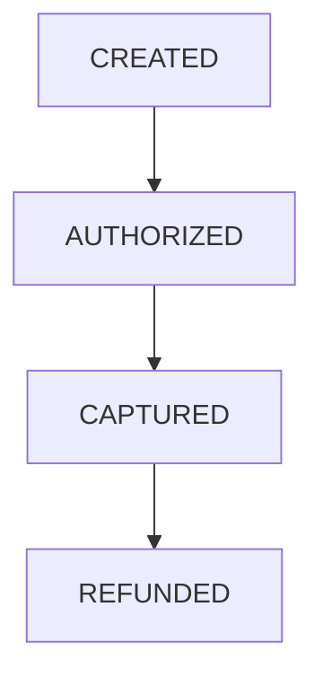
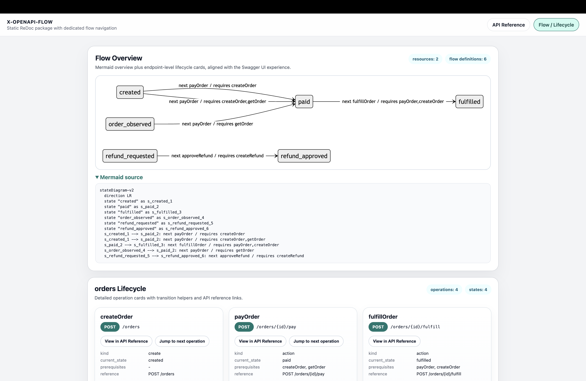
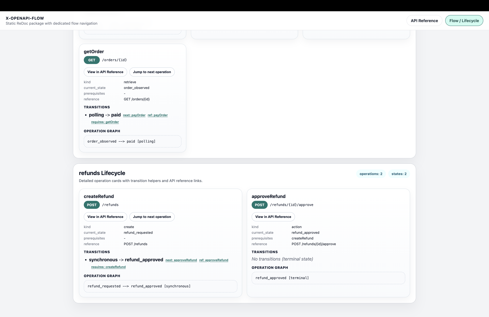
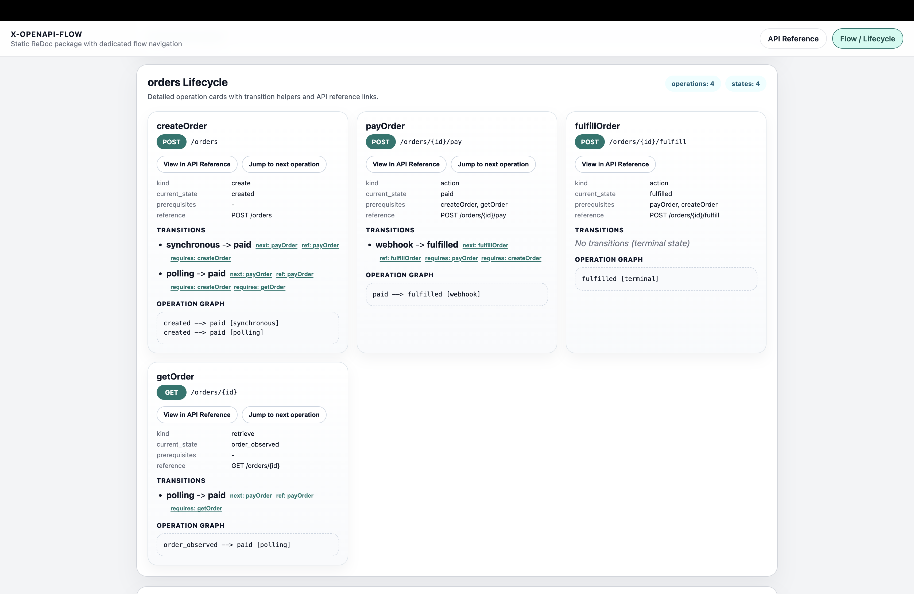
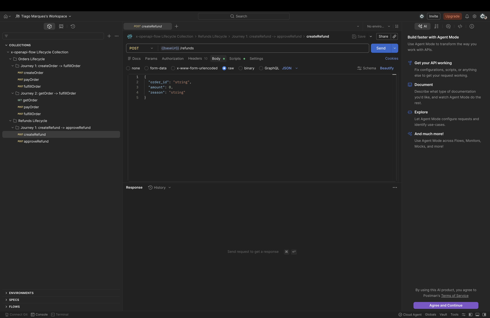
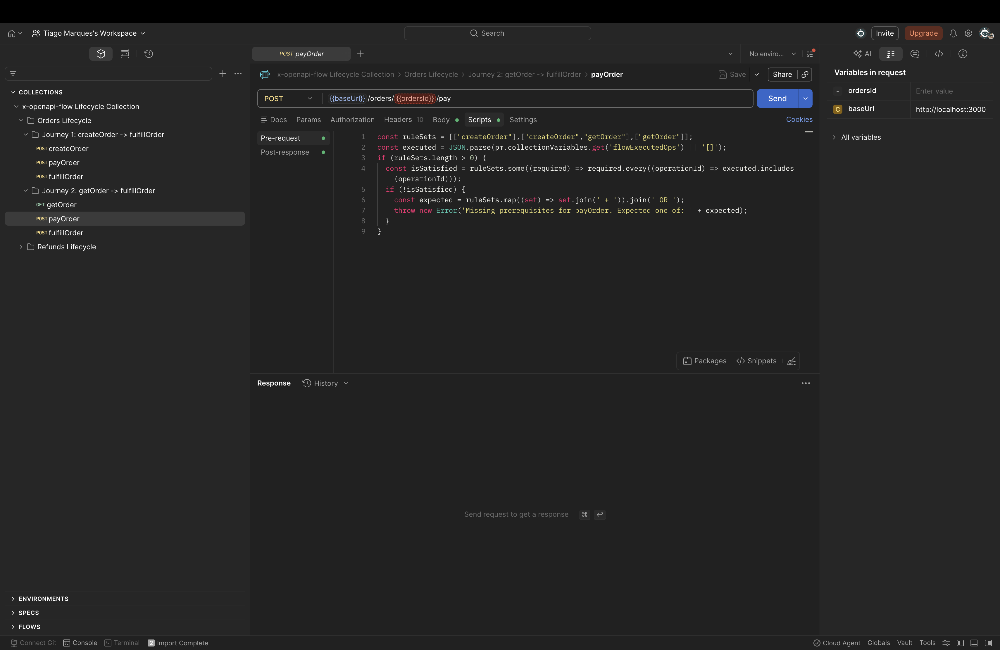
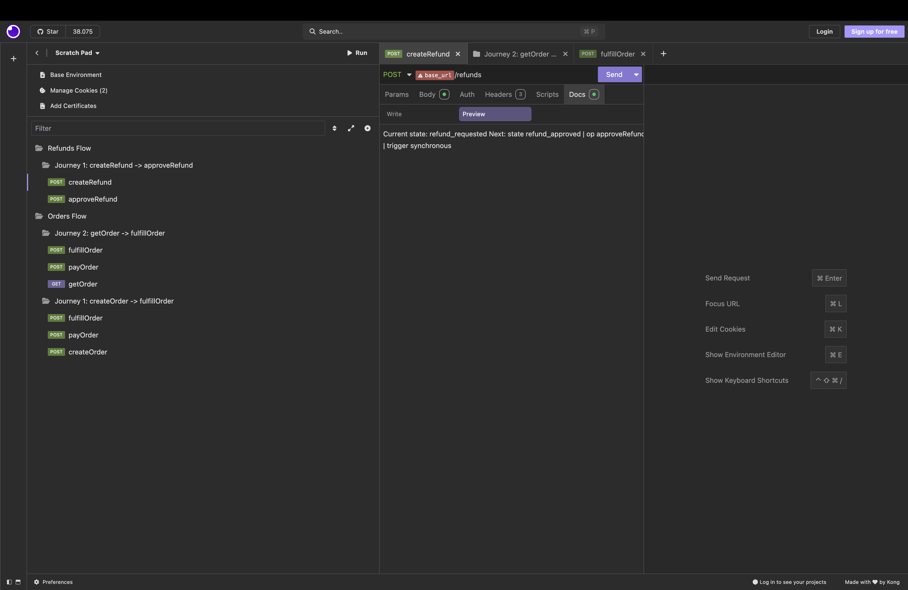
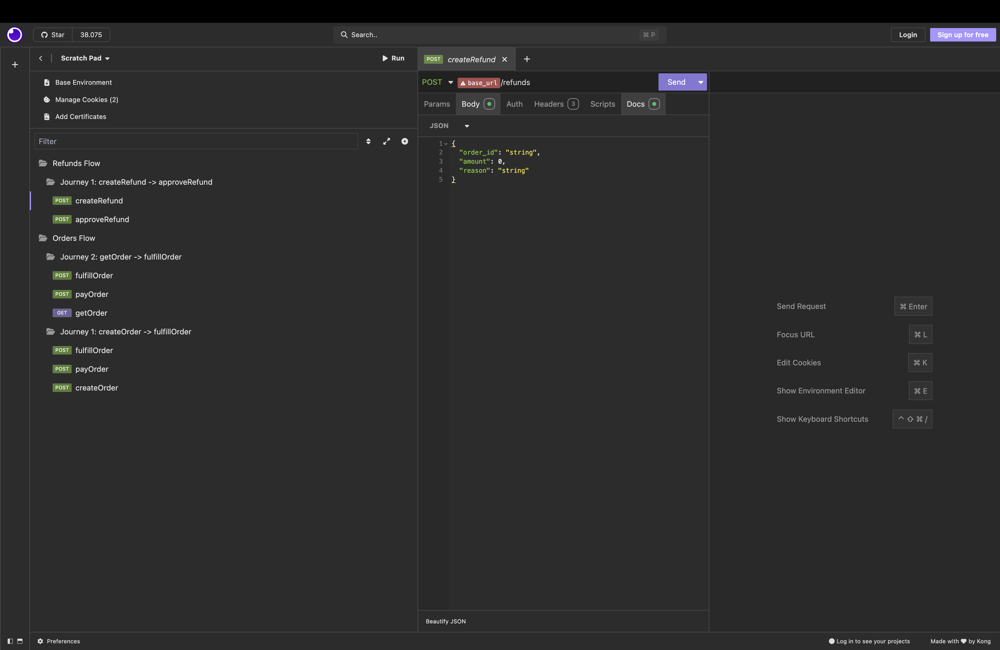

[](https://www.npmjs.com/package/x-openapi-flow)
[](https://www.npmjs.com/package/x-openapi-flow)


[](https://github.com/tiago-marques/x-openapi-flow/actions/workflows/x-openapi-flow-validate.yml)
[](https://github.com/tiago-marques/x-openapi-flow/issues)
[](https://github.com/tiago-marques/x-openapi-flow/commits/main)

> 🚀 1,400+ downloads in the first 3 weeks!

# OpenAPI describes APIs. x-openapi-flow describes their workflows — for developers and AI.


> See your API lifecycle come alive from your OpenAPI spec, with one simple command

> Validate, document, and generate flow-aware SDKs automatically.

`x-openapi-flow` adds a **declarative state machine** to your OpenAPI spec.

Model resource lifecycles, enforce valid transitions, and generate flow-aware artifacts for documentation, SDKs, and automation.

## Why This Exists

Building APIs is cheap. Building **complex, multi-step APIs that teams actually use correctly** is hard.  

Teams face recurring problems:

- 📄 **Manual documentation is brittle** – OpenAPI specs are static, often out of sync with real workflows  
- 🤖 **AI agents can hallucinate** – LLMs and code-generating agents may produce invalid calls if workflows are unclear or undocumented  
- 🤯 **Workflows are confusing** – multi-step operations are hard to track for humans and AI agents 
- ⚠️ **Invalid calls slip through** – developers make mistakes because lifecycle rules aren’t enforced  
- ⏱️ **Integration slows down** – SDKs, Postman collections, and docs need constant manual updates  
- 🛡️ **Hard to prevent errors in production** – without explicit lifecycle rules, invalid operations can reach live systems, causing outages or inconsistencies  


x-openapi-flow exists to **solve these pains**: it makes lifecycles explicit, validates transitions automatically, and generates flow-aware docs and SDKs — **so teams move faster, make fewer mistakes, and ship confident integrations**.

## What This Enables

Turn your OpenAPI spec into a single source of truth for API behavior:
- Visualize API lifecycles directly in [Swagger UI](#swagger-ui-demo) and [Redoc](#redoc-demo)
- Validate flows and state transitions in [CI pipelines](#cli-commands)
- Generate [lifecycle diagrams automatically](#mermaid-example) from your OpenAPI spec
- Build [SDKs](#sdk-generation) that understand and respect API workflows
- Export [Postman](#postman-demo) and [Insomnia](#insomnia-demo) collections organized by lifecycle
- Create [AI-ready API contracts](docs/wiki/engineering/AI-Sidecar-Authoring.md) for agentic integrations

## Quick Start

Initialize flow support in your project:

```bash
npx x-openapi-flow init
```

After regenerating your OpenAPI file, apply and validate the flow (optional):

```bash
npx x-openapi-flow apply openapi.yaml --out openapi.flow.yaml

npx x-openapi-flow validate openapi.flow.yaml --profile strict --strict-quality
```

This will:

- enrich your OpenAPI spec with flow metadata
- validate lifecycle consistency
- catch invalid transitions early

💡 Tip: run this in CI to enforce API workflow correctness

<a id="mermaid-example"></a>
### Real Lifecycle Example

Here’s a real-world payment lifecycle represented in x-openapi-flow:

```
CREATED -> AUTHORIZED -> CAPTURED -> REFUNDED
```

Generate a visual graph of the lifecycle:

```bash
npx x-openapi-flow graph openapi.flow.yaml --format mermaid
```

Resulting diagram:


```mermaid
graph TD
CREATED --> AUTHORIZED
AUTHORIZED --> CAPTURED
CAPTURED --> REFUNDED
```

> This visualization makes your API workflow explicit, easy to communicate, and ready for documentation or demos.

<a id="sdk-generation"></a>
## Generate Flow-Aware SDKs

Create a TypeScript SDK that **respects your API’s lifecycle and transition rules**, following best practices seen in leading companies like **Stripe** and **Adyen**:

- **Orchestrator by model**: each resource exposes methods that enforce valid transitions
- **Chainable API calls**: perform sequences naturally and safely

```bash
npx x-openapi-flow generate-sdk openapi.flow.yaml --lang typescript --output ./sdk
```

Example usage:

```ts
const payment = await sdk.payments.create({ amount: 1000 });
await payment.authorize();
await payment.capture();
```

> This SDK guides developers through valid transition paths, following patterns used by market leaders to ensure safe and intuitive integrations.

## Who Benefits Most

x-openapi-flow is ideal for teams and organizations that want **clear, enforceable API workflows**:

- **API-first organizations** – maintain a single source of truth for API behavior  
- **Teams building AI agents** – provide AI-friendly contracts and enforce correct API usage, so agents can safely call endpoints in the right order without guessing or violating workflow rules
- **API platform teams** – ensure consistent lifecycle rules across endpoints  
- **Companies with complex API workflows** – reduce errors and ambiguity in multi-step processes  
- **SDK teams** – generate flow-aware SDKs that guide developers  


## Why x-openapi-flow?

See how **x-openapi-flow extends OpenAPI** to make your API workflows explicit, enforceable, and actionable:

| Capability | OpenAPI | x-openapi-flow |
| --- | --- | --- |
| Endpoint contracts | ✅ Yes | ✅ Yes (fully compatible, extended) |
| Lifecycle states | ❌ No | ✅ Yes – define states for each resource |
| Transition validation | ❌ No | ✅ Yes – catch invalid calls before runtime |
| Flow diagrams | ❌ No | ✅ Yes – generate visual lifecycle graphs |
| Usage guidance (next valid actions) | Limited/manual | ✅ Built-in via lifecycle metadata – guides developers and AI agents |

## Integration Demos

Explore how x-openapi-flow integrates with popular API tools, making lifecycles and flows explicit for documentation and testing.

<a id="swagger-ui-demo"></a>
### Swagger UI – Visualize Flows in Your Docs

```bash
cd example/swagger-ui
npm install
npm run apply
npm start
```


> Lifecycle panel shows valid states and transitions


> Detailed view of transitions per operation

<a id="redoc-demo"></a>
### Redoc – Flow-Aware Documentation

```bash
cd example/redoc
npm install
npm run apply
npm run generate
```




> Auto-generated lifecycle diagrams make documentation clear and consistent

<a id="postman-demo"></a>
### Postman – Organized API Collections

```bash
cd example/postman
npm install
npm run apply
npm run generate
```



> Collections reflect lifecycle order, reducing integration errors

<a id="insomnia-demo"></a>
### Insomnia – Organized API Collections

```bash
cd example/insomnia
npm install
npm run apply
npm run generate
```



> Requests are pre-organized according to lifecycle transitions

<a id="cli-commands"></a>
## CLI Reference – Common Commands

Use x-openapi-flow from the command line to **manage, validate, visualize, and generate SDKs/docs for your API workflows**.  

### General

```bash
npx x-openapi-flow help [command]         # show help for a specific command

npx x-openapi-flow --help                 # general help

npx x-openapi-flow version                # show version

npx x-openapi-flow doctor [--config path] # check setup and config

npx x-openapi-flow completion [bash|zsh]  # enable shell autocompletion
```

### Workflow Management

```bash
# initialize flow support
npx x-openapi-flow init [--flows path] [--force] [--dry-run]   

# apply flows to OpenAPI
npx x-openapi-flow apply [openapi-file] [--flows path] [--out path]  

# validate transitions
npx x-openapi-flow validate <openapi-file> [--profile core|relaxed|strict] [--strict-quality]  
```

### Visualization & Documentation

```bash
# generate lifecycle diagrams
npx x-openapi-flow graph [openapi-file] [--format mermaid|json]   

# generate Redoc docs
npx x-openapi-flow generate-redoc [openapi-file] [--output path]   

# export flows
npx x-openapi-flow export-doc-flows [openapi-file] [--output path] [--format markdown|json]  
```

### SDK Generation

```bash
# generate flow-aware SDK
npx x-openapi-flow generate-sdk [openapi-file] --lang typescript [--output path] 
```

Full details:  

- [CLI-Reference.md](docs/wiki/reference/CLI-Reference.md)  
- [README.md](x-openapi-flow/README.md)

## Documentation and Guides

Get the most out of x-openapi-flow with detailed guides, examples, and integration instructions:

- **Adoption Guide** – [docs/wiki/getting-started/Adoption-Playbook.md](docs/wiki/getting-started/Adoption-Playbook.md)  
  Learn how to introduce x-openapi-flow into your API workflow efficiently

- **Troubleshooting** – [docs/wiki/reference/Troubleshooting.md](docs/wiki/reference/Troubleshooting.md)  
  Quick solutions to common issues and validation errors

- **Real Examples** – [docs/wiki/engineering/Real-Examples.md](docs/wiki/engineering/Real-Examples.md)  
  Explore real OpenAPI specs enhanced with lifecycle metadata

- **Integrations**:  
  - **Swagger UI** – [docs/wiki/integrations/Swagger-UI-Integration.md](docs/wiki/integrations/Swagger-UI-Integration.md)  
    See flow-aware panels in Swagger UI  
  - **Redoc** – [docs/wiki/integrations/Redoc-Integration.md](docs/wiki/integrations/Redoc-Integration.md)  
    Generate lifecycle diagrams in Redoc documentation  
  - **Postman** – [docs/wiki/integrations/Postman-Integration.md](docs/wiki/integrations/Postman-Integration.md)  
    Organize collections according to valid transitions  
  - **Insomnia** – [docs/wiki/integrations/Insomnia-Integration.md](docs/wiki/integrations/Insomnia-Integration.md)  
    Pre-configure requests according to lifecycle flows

## Roadmap

We’re actively expanding x-openapi-flow to support multiple platforms and SDKs. Check our progress:

- 🗂 **Roadmap Overview** – [#2](https://github.com/tiago-marques/x-openapi-flow/issues/2)  
  See planned features and high-level goals

- 🐍 **Python SDK MVP** – [#3](https://github.com/tiago-marques/x-openapi-flow/issues/3)  
  Enable Python developers to use flow-aware SDKs

- 🏎 **Go SDK MVP** – [#4](https://github.com/tiago-marques/x-openapi-flow/issues/4)  
  Bring lifecycle-aware SDKs to Go projects

- ☕ **Kotlin SDK MVP** – [#5](https://github.com/tiago-marques/x-openapi-flow/issues/5)  
  Support Android and JVM developers with flow-aware SDKs

## Changelog

Keep track of updates and improvements in x-openapi-flow:

- **Version History** – [CHANGELOG.md](CHANGELOG.md)  
  Review the full version history and past updates

- **Release Notes** – [docs/wiki/releases/RELEASE_NOTES_v1.4.0.md](docs/wiki/releases/RELEASE_NOTES_v1.4.0.md)  
  See detailed notes for the latest release, including new features and fixes

## Documentation Language Policy

To ensure clarity and accessibility for the global developer community, **all project documentation should be written in English**. This helps contributors, users, and AI agents understand and use x-openapi-flow consistently.
