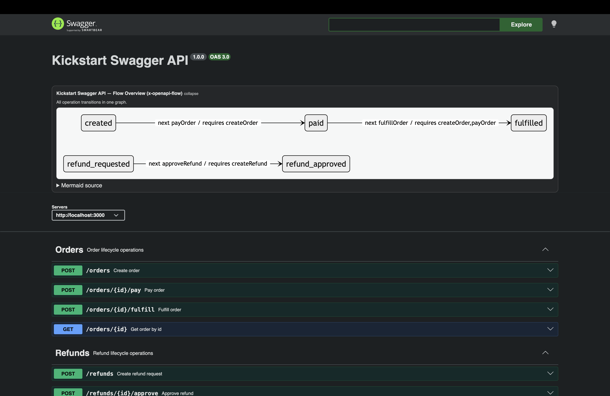

# x-openapi-flow


CLI and extension contract for documenting and validating resource lifecycle workflows in OpenAPI using `x-openapi-flow`.

## Overview

`x-openapi-flow` validates:

- Extension schema correctness
- Lifecycle graph consistency
- Optional quality checks for transitions and references

It also supports a sidecar workflow (`init` + `apply`) so lifecycle metadata stays preserved when OpenAPI source files are regenerated.

## Installation

```bash
npm install x-openapi-flow
```

Optional mirror on GitHub Packages (default usage remains unscoped on npm):

```bash
npm config set @tiago-marques:registry https://npm.pkg.github.com
npm install @tiago-marques/x-openapi-flow
```

If authentication is required, include this in your `.npmrc`:

```ini
//npm.pkg.github.com/:_authToken=${GH_PACKAGES_TOKEN}
```

Use a GitHub PAT with `read:packages` (install) and `write:packages` (publish).

## Quick Start

```bash
npx x-openapi-flow init
npx x-openapi-flow apply openapi.yaml
```

Optional checks:

```bash
npx x-openapi-flow validate openapi.yaml --profile strict
npx x-openapi-flow lint openapi.yaml
npx x-openapi-flow graph openapi.yaml
```

## CLI Commands

```bash
npx x-openapi-flow validate <openapi-file> [--format pretty|json] [--profile core|relaxed|strict] [--strict-quality] [--config path]
npx x-openapi-flow init [--flows path] [--force] [--dry-run]
npx x-openapi-flow apply [openapi-file] [--flows path] [--out path]
npx x-openapi-flow diff [openapi-file] [--flows path] [--format pretty|json]
npx x-openapi-flow lint [openapi-file] [--format pretty|json] [--config path]
npx x-openapi-flow graph <openapi-file> [--format mermaid|json]
npx x-openapi-flow doctor [--config path]
```

`diff` now reports field-level changes for operations that already exist in the sidecar.
In `pretty` format, this appears under `Changed details` with changed paths per operation (for example, `current_state` or `transitions[0].target_state`).
In `json` format, this appears in `diff.changedOperationDetails`:

```json
{
  "diff": {
    "changedOperationDetails": [
      {
        "operationId": "listItems",
        "changedPaths": ["current_state"]
      }
    ]
  }
}
```

### CI usage (`diff` as a gate)

Fail the pipeline when sidecar drift is detected:

```bash
npx x-openapi-flow diff openapi.yaml --format json | node -e '
const fs = require("fs");
const payload = JSON.parse(fs.readFileSync(0, "utf8"));
const diff = payload.diff || {};
const changes = (diff.added || 0) + (diff.removed || 0) + (diff.changed || 0);
if (changes > 0) {
  console.error("x-openapi-flow diff detected changes. Run init/apply and commit sidecar updates.");
  process.exit(1);
}
'
```

This keeps `.x` sidecar data aligned with the OpenAPI source in pull requests.

## Semantic lint (`lint`)

Use `lint` to run semantic checks focused on flow modeling quality.

```bash
npx x-openapi-flow lint openapi.yaml
npx x-openapi-flow lint openapi.yaml --format json
```

MVP semantic rules:

- `next_operation_id_exists`
- `prerequisite_operation_ids_exist`
- `duplicate_transitions`
- `terminal_path` (states without path to terminal)

Disable individual rules with config (`x-openapi-flow.config.json`):

```json
{
  "lint": {
    "rules": {
      "next_operation_id_exists": true,
      "prerequisite_operation_ids_exist": true,
      "duplicate_transitions": false,
      "terminal_path": true
    }
  }
}
```

## Graph JSON contract (`graph --format json`)

`graph --format json` returns a stable contract for CI/pipeline integrations:

- `format_version`: output contract version (currently `"1.0"`).
- `flowCount`: number of operations with `x-openapi-flow`.
- `nodes`: sorted state names (deterministic order).
- `edges`: sorted transitions by `from`, `to`, `next_operation_id`, and prerequisites.
- `mermaid`: deterministic Mermaid rendering of the same graph.

Example:

```json
{
  "format_version": "1.0",
  "flowCount": 3,
  "nodes": ["CONFIRMED", "CREATED", "SHIPPED"],
  "edges": [
    {
      "from": "CONFIRMED",
      "to": "SHIPPED",
      "next_operation_id": "shipOrder",
      "prerequisite_operation_ids": []
    }
  ],
  "mermaid": "stateDiagram-v2\n  state CONFIRMED\n  state CREATED\n  state SHIPPED\n  CONFIRMED --> SHIPPED: next:shipOrder"
}
```

## HTTP Methods Support

`init`, `apply`, and `graph` support all OpenAPI 3 HTTP operation methods:

- `get`
- `put`
- `post`
- `delete`
- `options`
- `head`
- `patch`
- `trace`

## Sidecar Workflow

Behavior summary:

- `init` works on an existing OpenAPI source file in your repository.
- `init` creates/synchronizes `{context}.x.(json|yaml)` as a persistent sidecar for `x-openapi-flow` data.
- If `{context}.flow.(json|yaml)` does not exist, `init` generates it automatically (same merge result as `apply`).
- If `{context}.flow.(json|yaml)` already exists, `init` asks in interactive mode whether to recreate it.
- On confirmation (or with `--force`), `init` creates a sidecar backup as `{context}.x.(json|yaml).backup-N` before regenerating `{context}.flow.(json|yaml)`.
- In non-interactive mode, `init` fails when flow output already exists unless `--force` is provided.
- With `--dry-run`, `init` prints a summary of sidecar/flow behavior without writing files.
- Use `apply` to inject sidecar flows back into regenerated OpenAPI source files.
- If no OpenAPI/Swagger source file exists yet, generate one first with your framework's official tooling.

### Recommended Sequence

```bash
npx x-openapi-flow init
npx x-openapi-flow init --dry-run
# edit {context}.x.(json|yaml)
npx x-openapi-flow diff openapi.yaml
npx x-openapi-flow apply openapi.yaml
```

## Sidecar File Contract (all supported fields)

Sidecar top-level shape:

```yaml
version: "1.0"
operations:
  - operationId: createOrder
    x-openapi-flow:
      version: "1.0"
      id: create-order
      current_state: CREATED
      description: Creates an order and starts its lifecycle
      idempotency:
        header: Idempotency-Key
        required: true
      transitions:
        - target_state: PAID
          trigger_type: synchronous
          condition: Payment approved
          next_operation_id: payOrder
          prerequisite_operation_ids:
            - createOrder
          prerequisite_field_refs:
            - createOrder:request.body.customer_id
          propagated_field_refs:
            - createOrder:response.201.body.order_id
```

Top-level (sidecar document):

- `version` (optional, string): sidecar contract version. Default is `"1.0"`.
- `operations` (optional, array): entries keyed by operation.

Per operation entry:

- `operationId` (recommended, string): target operation identifier in OpenAPI.
- `x-openapi-flow` (object): lifecycle metadata for that operation.
- `key` (optional, legacy): backward-compatibility fallback key used by apply.

`x-openapi-flow` fields:

- Required:
  - `version` (string): currently `"1.0"`.
  - `id` (string): unique flow id.
  - `current_state` (string): state represented by this operation.
- Optional:
  - `description` (string): human-readable purpose.
  - `idempotency` (object):
    - `header` (required, string)
    - `required` (optional, boolean)
  - `transitions` (array of transition objects)

Transition object fields:

- Required:
  - `target_state` (string)
  - `trigger_type` (enum): `synchronous`, `webhook`, `polling`
- Optional:
  - `condition` (string)
  - `next_operation_id` (string)
  - `prerequisite_operation_ids` (array of strings)
  - `prerequisite_field_refs` (array of strings)
  - `propagated_field_refs` (array of strings)

Field refs format:

- `operationId:request.body.field`
- `operationId:request.path.paramName`
- `operationId:response.<status>.body.field`

## Configuration

Create `x-openapi-flow.config.json` in your project directory:

```json
{
  "profile": "strict",
  "format": "pretty",
  "strictQuality": false
}
```

## Compatibility

- OpenAPI input in `.yaml`, `.yml`, and `.json`
- Validation processes OAS content with the `x-openapi-flow` extension

## Transition Guidance Fields

- `next_operation_id`: operationId usually called for the next state transition
- `prerequisite_operation_ids`: operationIds expected before a transition
- `prerequisite_field_refs`: required field refs before transition
- `propagated_field_refs`: field refs used by downstream flows

Field reference format:

- `operationId:request.body.field`
- `operationId:response.<status>.body.field`

## Visualization

### Swagger UI

- There is no Swagger UI-based automated test in this repo today (tests are CLI-only).
- For UI interpretation of `x-openapi-flow`, use `showExtensions: true` with the plugin at `lib/swagger-ui/x-openapi-flow-plugin.js`.
- A ready HTML example is available at `examples/swagger-ui/index.html`.
- The plugin renders a global **Flow Overview** (Mermaid image) near the top of the docs, plus operation-level flow cards.


### Graph Output Example

`x-openapi-flow graph` includes transition guidance labels in Mermaid output when present (`next_operation_id`, `prerequisite_operation_ids`).
The `graph` command accepts both full OpenAPI source files and sidecar files (`{context}.x.(json|yaml)` and legacy `{context}-openapi-flow.(json|yaml)`).



## Repository and Documentation

- Repository: https://github.com/tiago-marques/x-openapi-flow
- Full guide and changelog are available in the root repository.
