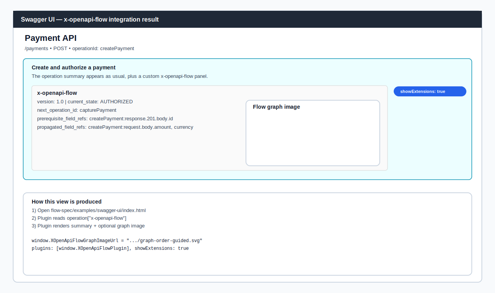

# x-openapi-flow

CLI and specification for validating the `x-openapi-flow` extension field in OpenAPI documents.

## Installation

```bash
npm install x-openapi-flow
```

## Quick Usage

```bash
x-openapi-flow validate openapi.yaml
x-openapi-flow graph openapi.yaml
x-openapi-flow doctor
```

## Commands

```bash
x-openapi-flow validate <openapi-file> [--format pretty|json] [--profile core|relaxed|strict] [--strict-quality] [--config path]
x-openapi-flow init [openapi-file] [--flows path]
x-openapi-flow apply [openapi-file] [--flows path] [--out path]
x-openapi-flow graph <openapi-file> [--format mermaid|json]
x-openapi-flow doctor [--config path]
```

`init` always works on an existing OpenAPI file in your repository.
`init` creates/synchronizes `x-openapi-flow.flows.yaml` as a persistent sidecar for your `x-openapi-flow` data.
Use `apply` to inject sidecar flows back into regenerated OpenAPI files.
If no OpenAPI/Swagger file exists yet, generate one first with your framework's official OpenAPI/Swagger tooling.

## Recommended Workflow

```bash
x-openapi-flow init openapi.yaml
# edit x-openapi-flow.flows.yaml
x-openapi-flow apply openapi.yaml
```

## Optional Configuration

Create `x-openapi-flow.config.json` in your project directory:

```json
{
  "profile": "strict",
  "format": "pretty",
  "strictQuality": false
}
```

## File Compatibility

- OpenAPI input in `.yaml`, `.yml`, and `.json`
- Validation processes OAS content with the `x-openapi-flow` extension

### Optional Transition Guidance Fields

- `next_operation_id`: operationId usually called for the next state transition
- `prerequisite_operation_ids`: operationIds expected before a transition
- `prerequisite_field_refs`: required field refs before transition
- `propagated_field_refs`: field refs used by downstream flows

Field reference format:

- `operationId:request.body.field`
- `operationId:response.<status>.body.field`

## Swagger UI

- There is no Swagger UI-based automated test in this repo today (tests are CLI-only).
- For UI interpretation of `x-openapi-flow`, use `showExtensions: true` plus the example plugin at `examples/swagger-ui/x-openapi-flow-plugin.js`.
- A ready HTML example is available at `examples/swagger-ui/index.html`.



## Graph Output Example

`x-openapi-flow graph` includes transition guidance labels in Mermaid output when present (`next_operation_id`, `prerequisite_operation_ids`).


## Repository and Full Documentation

- Repository: https://github.com/tiago-marques/x-openapi-flow
- Full guide and changelog are available in the root repository.
