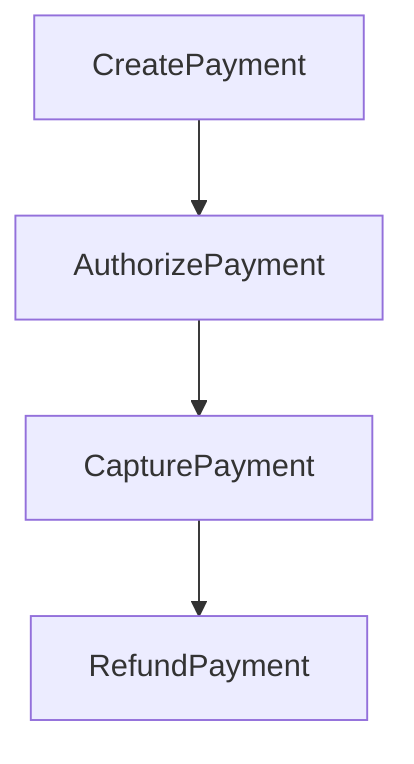

<!-- Auto-generated from /README.md via scripts/sync-package-readme.js. Do not edit directly. -->


[](https://www.npmjs.com/package/x-openapi-flow)
[](https://www.npmjs.com/package/x-openapi-flow)


[](https://github.com/tiago-marques/x-openapi-flow/actions/workflows/x-openapi-flow-validate.yml)
[](https://github.com/tiago-marques/x-openapi-flow/issues)
[](https://github.com/tiago-marques/x-openapi-flow/commits/main)


# OpenAPI describes APIs.
# x-openapi-flow describes how they actually work — for developers and AI.

`x-openapi-flow` is an OpenAPI vendor extension and CLI for documenting and validating resource lifecycle workflows.
It adds explicit state-machine metadata (`x-openapi-flow`) to operations and validates both schema and lifecycle graph consistency.

---

## Why This Project Matters

Most teams document endpoints but not lifecycle behavior. State transitions become implicit, inconsistent, and hard to validate in CI.
`x-openapi-flow` makes flows explicit, so teams can:

- Validate lifecycle consistency early in CI
- Generate flow-aware docs and diagrams
- Build SDKs that reduce invalid API calls

Result: faster onboarding, fewer integration regressions, and clearer contracts between API producers and consumers.

---

## TL;DR / Quick Start

From your API project root:

```bash
npx x-openapi-flow init
```
or
```bash
npx x-openapi-flow apply openapi.x.yaml
```

Default adoption path:

1. Generate or update your OpenAPI source.
2. Run `init` to create/sync sidecar flow metadata.
3. Run `apply` whenever the OpenAPI file is regenerated.

Sidecar and output roles:

- `{context}.x.(json|yaml)`: sidecar source of lifecycle metadata (the file you edit).
- `{context}.flow.(json|yaml)`: generated OpenAPI output after merge (the file you validate and serve in docs/tools).

Practical rule:

1. edit `.x`
2. run `apply`
3. validate/use `.flow`

Full rollout guide: [docs/wiki/getting-started/Adoption-Playbook.md](https://github.com/tiago-marques/x-openapi-flow/blob/main/docs/wiki/getting-started/Adoption-Playbook.md)
Troubleshooting: [docs/wiki/reference/Troubleshooting.md](https://github.com/tiago-marques/x-openapi-flow/blob/main/docs/wiki/reference/Troubleshooting.md)

---


1. Bootstrap once per project.

```bash
npx x-openapi-flow init
```

2. Re-apply sidecar metadata after each OpenAPI regeneration.

```bash
npx x-openapi-flow apply openapi.yaml
```

```bash
npx x-openapi-flow validate openapi.flow.yaml --profile strict --strict-quality
```

4. Optional diagnostics for review and troubleshooting.

```bash
npx x-openapi-flow diff openapi.yaml --format pretty
npx x-openapi-flow lint openapi.flow.yaml
npx x-openapi-flow graph openapi.flow.yaml --format mermaid
```

What this gives your team in practice:

- deterministic lifecycle checks in local dev and CI
- explicit transition contracts instead of implicit tribal knowledge
- safer API evolution with fewer integration regressions

## Integration Experience (What You See)

### Swagger UI

Use this when you want interactive docs with lifecycle context on each operation.

```bash
cd example/swagger-ui
npm install
npm run apply
npm start
```

Note: in this example, `npm run apply` prefers local sidecars (`swagger.x.yaml|yml|json`) and falls back to `examples/swagger.x.yaml|json` when a local sidecar is not present.

Experience outcome:

- operation docs enriched with `x-openapi-flow` fields
- visual lifecycle context while navigating endpoints

Demo media:


### Redoc

Use this when you want a static docs bundle to share internally or publish.

```bash
cd example/redoc
npm install
npm run apply
npm run generate
```

Experience outcome:

- portable `redoc-flow/` package with lifecycle panel
- stable documentation artifact for teams and portals

Demo media:


### Postman

Use this when you want collections aligned with lifecycle transitions.

```bash
cd example/postman
npm install
npm run apply
npm run generate
```

Experience outcome:

- flow-oriented Postman collection
- request execution closer to real transition paths

Demo media:


### Insomnia

Use this when your team runs API scenarios in Insomnia workspaces.

```bash
cd example/insomnia
npm install
npm run apply
npm run generate
```

Experience outcome:

- generated workspace export with grouped lifecycle requests
- faster onboarding to operation prerequisites and flow order

Demo media:


### SDK (TypeScript)

Use this when you want a generated flow-aware SDK for application integration.

```bash
cd example/sdk/typescript
npm install
npm run apply
npm run generate
npm run run:sample
```

Experience outcome:

- generated TypeScript SDK in `sdk/` from `x-openapi-flow` metadata
- minimal runnable sample showing typed SDK usage in `src/sample.ts`
- lifecycle-oriented methods and transition-aware resource instances

Example project:

- [example/sdk/typescript/README.md](https://github.com/tiago-marques/x-openapi-flow/blob/main/example/sdk/typescript/README.md)

More integration details:

- [docs/wiki/integrations/Swagger-UI-Integration.md](https://github.com/tiago-marques/x-openapi-flow/blob/main/docs/wiki/integrations/Swagger-UI-Integration.md)
- [docs/wiki/integrations/Redoc-Integration.md](https://github.com/tiago-marques/x-openapi-flow/blob/main/docs/wiki/integrations/Redoc-Integration.md)
- [docs/wiki/integrations/Postman-Integration.md](https://github.com/tiago-marques/x-openapi-flow/blob/main/docs/wiki/integrations/Postman-Integration.md)
- [docs/wiki/integrations/Insomnia-Integration.md](https://github.com/tiago-marques/x-openapi-flow/blob/main/docs/wiki/integrations/Insomnia-Integration.md)

---

## CLI in Practice (Server Workflow)

Use this sequence as your default lifecycle guardrail in backend projects:

```bash
# 1) Bootstrap sidecar from OpenAPI source
npx x-openapi-flow init

# 2) Merge sidecar into flow-aware OpenAPI output
npx x-openapi-flow apply openapi.yaml --out openapi.flow.yaml

# 3) Detect drift before commit
npx x-openapi-flow diff openapi.yaml --format pretty

# 4) Enforce lifecycle quality gates
npx x-openapi-flow validate openapi.flow.yaml --profile strict --strict-quality
npx x-openapi-flow lint openapi.flow.yaml

# 5) Generate graph artifact for PR discussion
npx x-openapi-flow graph openapi.flow.yaml --format mermaid
```

CLI quick references for daily usage:

```bash
npx x-openapi-flow help [command]
npx x-openapi-flow <command> --help
npx x-openapi-flow <command> --verbose
npx x-openapi-flow completion [bash|zsh]
```

---

## SDK Generation Experience (TypeScript)

Generate a flow-aware SDK directly from your OpenAPI + `x-openapi-flow` metadata:

```bash
npx x-openapi-flow generate-sdk openapi.flow.yaml --lang typescript --output ./sdk
```

What you get:

- resource-centric classes with lifecycle-safe methods
- operation transition awareness (`next_operation_id`, prerequisites, propagated fields)
- reusable client layer for application services

Typical integration snippet:

```ts
import { FlowApiClient } from "./sdk/src";

const api = new FlowApiClient({ baseUrl: process.env.API_BASE_URL });

const payment = await api.payments.create({ amount: 1000 });
await payment.authorize();
await payment.capture();
```

---

## Example: Payment Flow



### Flow-aware SDK Example (TypeScript)

```ts
const payment = await sdk.payments.create({ amount: 1000 });
await payment.authorize();
await payment.capture();
await payment.refund();
```

At each stage, only valid lifecycle actions should be available.

---

## Installation

Install from npm (default):

```bash
npm install x-openapi-flow
```

Optional mirror from GitHub Packages:

```bash
npm config set @tiago-marques:registry https://npm.pkg.github.com
npm install @tiago-marques/x-openapi-flow
```

If authentication is required, add to `.npmrc`:

```ini
//npm.pkg.github.com/:_authToken=${GITHUB_PACKAGES_TOKEN}
```

Use a GitHub PAT with `read:packages` (install) and `write:packages` (publish).

---

## CLI Reference (Selected Commands)

```bash
npx x-openapi-flow help [command]
npx x-openapi-flow --help
npx x-openapi-flow version
npx x-openapi-flow --version
npx x-openapi-flow validate <openapi-file> [--profile core|relaxed|strict] [--strict-quality]
npx x-openapi-flow init [--flows path] [--force] [--dry-run]
npx x-openapi-flow apply [openapi-file] [--flows path] [--out path]
npx x-openapi-flow analyze [openapi-file] [--format pretty|json] [--out path] [--merge] [--flows path]
npx x-openapi-flow generate-sdk [openapi-file] --lang typescript [--output path]
npx x-openapi-flow export-doc-flows [openapi-file] [--output path] [--format markdown|json]
npx x-openapi-flow generate-redoc [openapi-file] [--output path]
<!-- Demo media removed -->
npx x-openapi-flow doctor [--config path]
npx x-openapi-flow completion [bash|zsh]
```

Global flag for troubleshooting:

```bash
npx x-openapi-flow <command> --verbose
```

Full command details:

- [docs/wiki/reference/CLI-Reference.md](https://github.com/tiago-marques/x-openapi-flow/blob/main/docs/wiki/reference/CLI-Reference.md)
- [x-openapi-flow/README.md](https://github.com/tiago-marques/x-openapi-flow/blob/main/x-openapi-flow/README.md)

---

<!-- Demo media removed -->

- Auto-detects OpenAPI source files (`openapi.yaml`, `openapi.json`, `swagger.yaml`, etc.)
- Creates or syncs `{context}.x.(json|yaml)` (sidecar with lifecycle metadata)
- Generates `{context}.flow.(json|yaml)` automatically when missing
- In interactive mode, asks before recreating existing flow files
- In non-interactive mode, requires `--force` to recreate when flow file already exists

Recommended quality gate:

```bash
npx x-openapi-flow validate openapi.yaml --profile strict
```

---

## Validation Profiles

- `core`: schema and orphan checks only
<!-- Demo media removed -->
- Schema contract correctness
- Orphan states
- Initial/terminal state structure
- Cycles and unreachable states
- Quality findings (duplicate transitions, invalid refs, non-terminating states)

---

## Integrations

- Swagger UI: flow overview + operation-level extension panels
- Redoc: generated package with flow panel
- Postman and Insomnia: generated lifecycle-aware collections/workspaces
- SDK generator: TypeScript available, other languages planned

## Roadmap

SDK generation is currently production-ready for TypeScript.
Multi-language support is tracked publicly in GitHub issues:

- Roadmap umbrella: [#2](https://github.com/tiago-marques/x-openapi-flow/issues/2)
- Python SDK MVP: [#3](https://github.com/tiago-marques/x-openapi-flow/issues/3)
- Go SDK MVP: [#4](https://github.com/tiago-marques/x-openapi-flow/issues/4)
- Kotlin SDK MVP: [#5](https://github.com/tiago-marques/x-openapi-flow/issues/5)

<!-- Demo media removed -->
Integration docs:

- [docs/wiki/integrations/Swagger-UI-Integration.md](https://github.com/tiago-marques/x-openapi-flow/blob/main/docs/wiki/integrations/Swagger-UI-Integration.md)
---
## Copilot Ready (AI Sidecar Authoring)

Use [llm.txt](https://github.com/tiago-marques/x-openapi-flow/blob/main/llm.txt) as authoring guidance for sidecar population.

Typical AI-assisted loop:

1. `init`
2. AI fills `{context}.x.(json|yaml)`
3. `apply`
4. `validate --profile strict`

Prompt template:

```text
Use llm.txt from this repository as authoring rules.
Populate {context}.x.(json|yaml) per operationId with coherent lifecycle states and transitions,
including next_operation_id, prerequisite_field_refs, and propagated_field_refs when applicable.
Do not change endpoint paths or HTTP methods.
```

---

## Regeneration Workflow

```bash
# 1) Generate or update OpenAPI source
# 2) Initialize sidecar metadata
npx x-openapi-flow init
# 3) Edit {context}.x.(json|yaml)
# 4) Re-apply after each OpenAPI regeneration
npx x-openapi-flow apply openapi.x.yaml
```

---

## Included Examples

- `payment-api.yaml` (financial)
- `order-api.yaml` (e-commerce/logistics)
- `ticket-api.yaml` (support)
- `quality-warning-api.yaml` (quality warnings)
- `non-terminating-api.yaml` (non-terminating states)

More examples: [docs/wiki/engineering/Real-Examples.md](https://github.com/tiago-marques/x-openapi-flow/blob/main/docs/wiki/engineering/Real-Examples.md)

---

## Repository Structure

- [x-openapi-flow/schema/flow-schema.json](https://github.com/tiago-marques/x-openapi-flow/blob/main/x-openapi-flow/schema/flow-schema.json): extension JSON Schema contract
- [x-openapi-flow/lib/validator.js](https://github.com/tiago-marques/x-openapi-flow/blob/main/x-openapi-flow/lib/validator.js): schema + graph validation engine
- [x-openapi-flow/bin/x-openapi-flow.js](https://github.com/tiago-marques/x-openapi-flow/blob/main/x-openapi-flow/bin/x-openapi-flow.js): CLI entrypoint
- `x-openapi-flow/examples/*.yaml`: sample OpenAPI files
- [.github/workflows/x-openapi-flow-validate.yml](https://github.com/tiago-marques/x-openapi-flow/blob/main/.github/workflows/x-openapi-flow-validate.yml): CI validation example

---

## Changelog

Version history: [CHANGELOG.md](https://github.com/tiago-marques/x-openapi-flow/blob/main/CHANGELOG.md)
Release notes: [docs/wiki/releases/RELEASE_NOTES_v1.4.0.md](https://github.com/tiago-marques/x-openapi-flow/blob/main/docs/wiki/releases/RELEASE_NOTES_v1.4.0.md)

---

## Documentation Language Policy

All project documentation must be written in English, including:

- Repository Markdown files
- Wiki pages
- Release notes and changelog entries

If a contribution includes non-English documentation content, it should be translated to English before merge.
